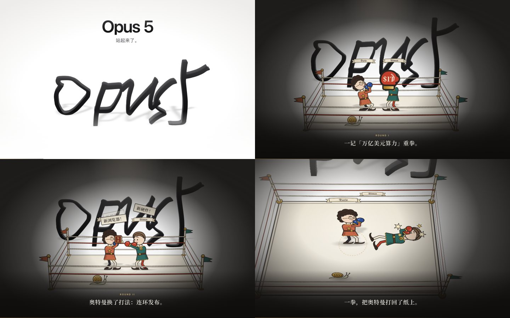

# handwriting-stand-up

给一段**手写字的录屏**（或一张手写字照片），做成一个**单文件 HTML 的“续集”**：

1. 先在 iPhone 模型里播放你的原视频；
2. 视频最后一帧无缝切换成矢量描边，备忘录界面淡出，纸面变成无限大的舞台；
3. 手写的字一个个**立起来**，变成有厚度的 3D 黑墨；
4. 字前面上演一段约 90 秒的小故事：中世纪手抄本页边画风的小人、蜗牛裁判、字幕、合成音效和鲁特琴配乐；
5. 最后所有东西倒回纸上、回到手机里，备忘录里多了几幅页边小画。



成品见 [`examples/opus5/opus5.html`](examples/opus5/opus5.html)（下载后直接用浏览器打开）：手写的 “Opus5” 立起来，达里奥和奥特曼两个中世纪小人为这一页纸打了三个回合。

## 用法

装好之后（见仓库根目录 README），把视频或照片丢给 Claude Code，直接说：

> 把这个视频里的手写字立起来，讲个 XX 的故事

它会：描边切块 → 让你确认切块和支点 → 跟你定故事 → 写 `story.js` → 截图自查（横屏 + 竖屏）→ 打包成一个 HTML。

也可以手动跑：

```bash
H=~/.claude/skills/minli-skill/skills/handwriting-stand-up

python3 $H/scripts/prepare.py 录屏.mp4 --out ~/stand-up/demo      # 描边、切块、生成工程
open ~/stand-up/demo/trace_check.png                                # 检查切块和支点（虚线）
# 编辑 ~/stand-up/demo/assets/story.js —— 改 CAST / LINES 就是一个新故事
(cd $H/scripts && npm i playwright-core)                            # 截图工具的依赖，装一次
node $H/scripts/shot.js ~/stand-up/demo --times 6,24,37.4,62.5,66,90
python3 $H/scripts/build.py ~/stand-up/demo                         # → dist/demo.html
```

## 切块不对怎么办

`trace_check.png` 上每一块一个颜色、带编号，虚线是它立起来时“铰”在纸上的那条线。

| 现象 | 参数 |
|---|---|
| 两个字被当成一块 / 一个字被拆开 | `--cuts x1,x2`（按原图像素，在这些 x 处切开） |
| 块太碎 | `--max-pieces 5` 或 `--merge-gap 20` |
| 虚线不在字的底线上 | `--pivots y1,y2,...`（每块一个） |
| 按钮、状态栏被当成了字 | `--roi x,y,w,h` |
| 字没识别全 / 背景被识别进来 | `--thresh 150` |

竖屏录屏默认会跳过上下 11% 的系统界面，并去掉第一帧里就有的深色内容（静态 UI）。

## 故事怎么写

`story.js` 默认就是一个能直接跑的完整故事（两位骑士抢这一页纸，三个回合）。所有位置都相对“手写字 + 擂台”计算，换任何字都能跑。

- 最省事：只改开头的 `CAST`（名字、配色、发型、帽子、胡子、眼镜、手里的书）和 `LINES`（每一句字幕），就是另一个故事。
- 换剧情：用 `S.knight / S.writeIn / S.shot / S.caption / S.card / S.lights / S.rock / S.finale` 这套工具重新编排，全部 API 见 [`references/story-api.md`](references/story-api.md)。

人物外观可选：发型 `curly / short / long / bald`，帽子 `crown / helmet / beret`，胡子、眼镜、拳套或空手、胸前纹章、手里的小书（书名 1–3 个字）。

## 依赖

```bash
pip install opencv-python numpy
brew install ffmpeg
(cd scripts && npm i playwright-core)    # 只有截图自查需要；需要本机有 Chrome/Chromium
```

打包时会从 Google Fonts 按故事用到的字**子集化**下载思源宋体等字体并内嵌（几十 KB）；离线就加 `--no-fonts` 用系统字体。

## 已知短板

- 假设**深色墨水、浅色纸面**；彩色笔迹或深色背景要手动调 `--thresh`。
- 人物只有一套“页边小人”骨骼（可换装，不能换成动物或别的体型），另外只有一只蜗牛。
- 每块字 18 层 SVG 叠出厚度，块数建议 ≤ 8，太长的一句话会比较吃性能。
- 用到了 [GSAP](https://gsap.com)（`engine/gsap.min.js`，遵循其免费许可）。
